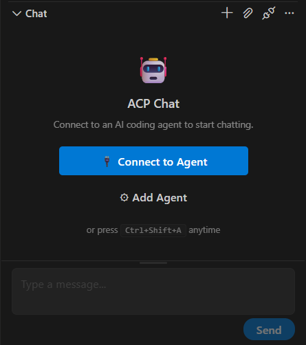
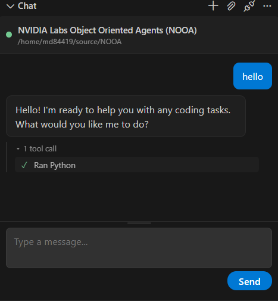

# Quickstart: NOOA in VS Code with a DGX Spark (Ollama)

Get NOOA running from a fresh checkout, wired to Ollama models hosted on a
remote DGX Spark, and driven from inside VS Code via an Agent Client Protocol
(ACP) extension.

**Prerequsites**

- VS Code with the WSL / Remote extension, working inside the NOOA checkout
- A DGX Spark running Ollama on local subnet or VPN e.g. your Tailscale tailnet
- `uv` installed (`curl -LsSf https://astral.sh/uv/install.sh | sh`)

## 1. Install the project

```bash
uv sync
```

`uv sync --all-extras` installs every optional extra (`cli`, `memory`,
`bench`, `acp`, `arc`, `tracing`, `viewer`, `sandbox`, `mcp`, `nemo-relay`) —
**but it fails on Ubuntu 22.04** with:

```
error: Distribution `openshell==0.0.75` can't be installed because it
doesn't have a source distribution or wheel for the current platform
```

The `sandbox` extra's `openshell` wheel requires glibc ≥ 2.39
(`manylinux_2_39_x86_64`). Ubuntu 22.04 (jammy) ships glibc 2.35 — check
with `ldd --version`. Don't try to upgrade glibc in place; it will break the
OS. Options:

- Skip `sandbox` (recommended) — sync everything else explicitly:

  ```bash
  uv sync --extra cli --extra memory --extra bench --extra acp \
          --extra arc --extra tracing --extra viewer --extra mcp \
          --extra nemo-relay
  ```

- Or use Ubuntu 24.04+ (glibc 2.39), e.g. a fresh WSL distro:
  `wsl --install Ubuntu-24.04` from PowerShell, or the
  [Microsoft Store listing](https://apps.microsoft.com/detail/9nz3klhxdjp5).

The uv error hints at `tool.uv.required-environments`, but that only fixes
*lockfile resolution* — PEP 508 markers can't express glibc version, so the
wheel still won't run on glibc 2.35.

## 2. Verify the install

```bash
uv run python -c "import nooa; print(nooa.__version__)"
```

## 3. Verify the DGX Spark Ollama endpoint

If Ollama on the Spark is bound to the tailnet interface, it is reachable at
`http://<spark-hostname>.<tailnet>.ts.net:11434`. Check it and list models:

```bash
curl -s http://<spark-hostname>.<tailnet>.ts.net:11434/api/tags \
  | python3 -c "import json,sys; print('\n'.join(m['name'] for m in json.load(sys.stdin)['models']))"
```

Example output from a DGX Spark:

```
gpt-oss:120b
qwen3.6:35b-a3b
qwen3-coder:30b
qwen3.5:27b
nemotron-3-nano:30b
nemotron-3-nano:4b
...
```

## 4. List the client types

```
cd /home/<User>/source/NOOA && uv run python -c "
from nooa.unifiedllm.registry import get_llm_client
for alias in ('dgx-coder', 'dgx-general', 'dgx-fast', 'dgx-big'):
    try:
        client = get_llm_client(alias)
        print(f'{alias}: OK -> {type(client).__name__}')
    except Exception as e:
        print(f'{alias}: FAIL -> {e}')
"
dgx-coder: OK -> CompletionClient
dgx-general: OK -> CompletionClient
dgx-fast: OK -> CompletionClient
dgx-big: OK -> CompletionClient
```

## 5. Register the DGX models as NOOA aliases

NOOA resolves LiteLLM model strings through `get_llm_client()` (see
[local-models.md](local-models.md)). Ollama uses the `ollama_chat/<model>`
route, base URL **without** `/v1`, and no API key.

Create `.nooa/llm_config.yaml` in the project root:

```yaml
models:
  dgx-coder:
    model_name: ollama_chat/qwen3-coder:30b
    api_base: http://<spark-hostname>.<tailnet>.ts.net:11434

  dgx-general:
    model_name: ollama_chat/qwen3.6:35b-a3b
    api_base: http://<spark-hostname>.<tailnet>.ts.net:11434

  dgx-fast:
    model_name: ollama_chat/nemotron-3-nano:4b
    api_base: http://<spark-hostname>.<tailnet>.ts.net:11434

  dgx-big:
    model_name: ollama_chat/gpt-oss:120b
    api_base: http://<spark-hostname>.<tailnet>.ts.net:11434
```

Project-local config sits on the discovery chain (bundled < user-global <
project-local < `NEMO_OO_LLM_CONFIG` env var), so it is picked up
automatically. Confirm with the CLI:

```bash
uv run nooa config show
# Project config (.../.nooa/llm_config.yaml): present (4 aliases)
```

Smoke-test a live round-trip:

```bash
uv run python - <<'EOF'
from nooa.unifiedllm.registry import get_llm_client
llm = get_llm_client("dgx-fast")
resp = llm.call(messages=[{"role": "user", "content": "Reply with exactly: PONG"}])
print(resp.content)   # -> PONG
EOF
```

Note: `LLMResponse` has a terse repr — the text is on `.content`, so
`print(resp)` looks empty even on success.

## 6. The CLI and the ACP server

The `nooa` CLI comes from the `nooa-cli` workspace package:

```bash
uv run nooa --help
```

Relevant commands: `acp` (stdio agent server), `config` (inspect the config
chain), `connect` (guided model setup), `start-dev` (trace viewer on port
5001), `traces`, `eval`.

Test that the ACP server starts and answers a JSON-RPC `initialize`
handshake:

```bash
uv run nooa acp --model dgx-fast
```

then type/paste one line into its stdin:

```json
{"jsonrpc":"2.0","id":1,"method":"initialize","params":{"protocolVersion":1,"clientCapabilities":{}}}
```

Expected response:

```json
{"jsonrpc":"2.0","id":1,"result":{"protocolVersion":1,"agentCapabilities":{...},"agentInfo":{"name":"nooa-acp","title":"NVIDIA Labs Object Oriented Agents (NOOA)",...}}}
```

Ctrl-C to stop. There is no default model — `--model` (or `NOOA_MODEL`) is
required, and any configured alias works.

## 7. Drive it from VS Code

VS Code has no native ACP support, but ACP client extensions exist. Install
**ACP Client** by Jun Han (`formulahendry.acp-client`) from the Marketplace.

The extension reads an `acp.agents` settings object: each key is an agent
name, each value has `command`, `args`, `env`. Add to `settings.json`
(Machine scope if you want it on this remote host):

```json
"acp.agents": {
  "NOOA (DGX qwen3-coder)": {
    "command": "uv",
    "args": [
      "run", "--project", "/home/<User>/source/NOOA",
      "nooa", "acp", "--model", "dgx-coder"
    ],
    "env": {}
  },
  "NOOA (DGX gpt-oss 120b)": {
    "command": "uv",
    "args": [
      "run", "--project", "/home/<User>/source/NOOA",
      "nooa", "acp", "--model", "dgx-big"
    ],
    "env": {}
  }
}
```

(Adjust the `--project` path to your checkout.)

Reload the VS Code window, open the ACP Client panel, and pick a NOOA agent
from its agent selector. The extension spawns the server over stdio — the
same handshake tested in step 4.

Useful extension settings:

- `acp.autoApprovePermissions`: `"ask"` (default) prompts before file
  edits/terminal commands; `"allowAll"` for autonomous runs.
- `acp.logTraffic`: `true` (default) logs all ACP protocol traffic to the
  output channel — the first place to look if an agent fails to appear.

No credentials are needed in `env` if using tailnet — the DGX Ollama endpoint is
unauthenticated on the tailnet. For hosted providers, put the key in `env` (e.g.
`NVIDIA_API_KEY`) or use a secret-manager wrapper as the `command`.

## 8. Using the ACP Client

Connect the Chat to the ACP agent - pick one of the models you configured in the previous step.



Try a simple textual prompt such as hello or ping.



Now try a prompt such as:
```
Run `ls examples/quickstart/` and tell me what's there
```
It should show you the results of the ls command and show that it ran two tool calls.

Now rey editing a file:
```
Add a comment "# tested via ACP" to the top of examples/README.md
```
That too should succeed.

| Step | Status |
| - | - |
| Agent appears in ACP Client | ✅ (you selected it) |
| Initialize handshake | ✅ (server started, agent responded) |
| Chat round-trip | ✅ (answered prompts) |
| Terminal command execution | ✅ (ls ran and returned output) |
| File editing | ✅ (File is modified after permission is granted) |

## 9. Using the LSP skill

NOOA ships an LSP skill ([src/nooa/lsp/](../src/nooa/lsp/)) that gives agents
compiler-accurate code navigation — definitions, references, document symbols,
renames, diagnostics — by spawning real language servers (pyright for Python,
plus registry entries for TS/JS, Rust, Go, C/C++).

### 9.1 Install a language server

The Python route needs `pyright-langserver` on `PATH`:

```bash
which pyright-langserver || npm i -g pyright
```

### 9.2 Register the skill

The skill must be exposed via the `nooa.skills` entry-point group so the
agent discovers it at startup. Ensure the project `pyproject.toml` contains:

```toml
[project.entry-points."nooa.skills"]
# ... existing entries ...
"nemo.lsp" = "nooa.lsp.skill:LSPSkill"
```

Then re-sync to refresh the installed metadata and verify discovery:

```bash
uv sync --extra cli --extra memory --extra bench --extra acp \
        --extra arc --extra tracing --extra viewer --extra mcp \
        --extra nemo-relay

uv run python -c "from importlib.metadata import entry_points; \
  print('nemo.lsp' in [ep.name for ep in entry_points(group='nooa.skills')])"
# -> True
```

### 9.3 Smoke-test outside the agent

```bash
uv run python - <<'EOF' 2>/dev/null | grep -A4 RESULT
import asyncio
from nooa.lsp.skill import LSPSkill

async def main():
    skill = LSPSkill()
    refs = await skill.find_references(
        "src/nooa/unifiedllm/registry.py", "get_llm_client"
    )
    print(f"RESULT: {len(refs)} references")
    for r in refs:
        print(" ", r["uri"].split("/")[-1], r["range"]["start"])
    await skill.shutdown()

asyncio.run(main())
EOF
# RESULT: 3 references
#   registry.py {'line': 300, 'character': 4}
#   __init__.py {'line': 23, 'character': 4}
#   __init__.py {'line': 51, 'character': 5}
```

`find_references(filepath, symbol)` is the one-call convenience path: it
resolves the symbol via `document_symbols()`, adjusts the query position onto
the symbol *name* (the declaration range starts at the `def` keyword, where
servers return nothing), then queries `references()` with the declaration
included.

Two quirks to know:

- The LSP client logs `RuntimeError: Event loop is closed` during shutdown —
  cosmetic noise from pipe cleanup, results are unaffected.
- References are accurate but not automatically repo-wide: pyright only
  reports files it has analyzed, so you may see fewer hits than a text search
  (e.g. 3 vs. 50 for `get_llm_client`, because most test files were never
  opened). Use repo tools for exhaustive counts, LSP for precision.

### 9.4 Test through the ACP client

**Restart the NOOA agent session** first — skills are discovered at server
startup, so a session started before step 9.2 won't see `nemo.lsp`.

Then prompt:

```
Use self.lsp.find_references("src/nooa/unifiedllm/registry.py", "get_llm_client")
```

Expected: a single tool call returning 3 locations (the definition plus the
import/export in `__init__.py`), followed by a summary.

Notes on agent ergonomics, learned from the ACP traffic logs:

- All skill/facade methods are **async** — `self.lsp.for_file(...)` returns a
  coroutine unless awaited (the docstrings now say "Must be awaited", but the
  agent still needs to read them — `doc(self.lsp)` shows the full API).
- `document_symbols()` returns LSP **dicts** (`symbol["name"]`,
  `symbol["location"]["range"]`), not Python objects with attributes.
- The position-based facade methods take separate `line, character` ints —
  passing a range dict raises `TypeError`. `find_references()` avoids all of
  this and is the recommended entry point.
- If the agent falls back to `repo.refs()` (name-based, tree-sitter/ripgrep
  heuristics), steer it: "Use the LSP skill (self.lsp), not repo tools."

```
Use the LSP skill (self.lsp), not repo tools. Get a facade with
self.lsp.for_file("src/nooa/unifiedllm/registry.py"), use document_symbols()
to locate get_llm_client, then references() at that position.
```


---

## Troubleshooting

| Symptom | Cause / fix |
|---------|-------------|
| `uv sync --all-extras` fails on `openshell` | glibc < 2.39; skip the `sandbox` extra (step 1) |
| `nooa acp` exits with a usage error | No model set — pass `--model` or `NOOA_MODEL` |
| Agent missing from the ACP panel | Reload the window; check the ACP Client output channel (`acp.logTraffic`) |
| `uv run nooa-cli` fails | The executable is `nooa`, not `nooa-cli` (that is the package name) |
| Empty-looking response in Python | Read `.content` on `LLMResponse`; its repr is empty |
